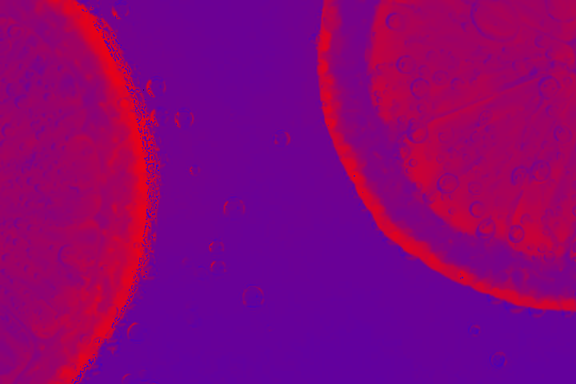
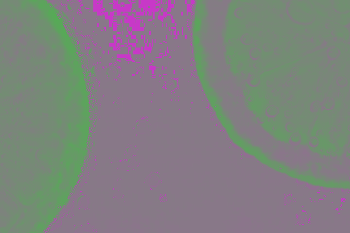

# CLY - Crystalline lossy
An Unlicense custom image crate. Please don't affiliate your project with me. You can claim that you made it or found it in a buried hard drive instead.

Other assets, such as image, are under CC0.

There will be some educational Python scripts in the `/edu` folder used during creation of CLY. I took time to name them descriptively.

## Blueprint
**Quadtree split macroblocks:**
-	**Lossless**
	-	RGB565 -> Self-similarity transform -> Sparse (XOR/Delta encoding & swap) bitplane encoding -> RLE -> Elias gamma coding
	-	RGB565 -> Self-similarity transform -> FWHT -> RLE -> Elias gamma coding
	-	RGB565 -> Self-similarity transform -> Haar wavelet -> RLE -> Elias gamma coding
-	**Lossy**
	-	YCoCg655 -> 4:2:0 -> DCT-II -> Attention map quantization -> Self-similarity transform -> Zig-Zag -> block-to-block delta coding -> Elias gamma coding
	-	YCoCg655 -> 4:2:0 -> DST-II -> Attention map quantization -> Self-similarity transform -> Zig-Zag -> block-to-block delta coding -> Elias gamma coding
	-	YCoCg655 -> 4:2:0 -> FWHT -> Attention map quantization -> Self-similarity transform -> Zig-Zag -> block-to-block delta coding -> Elias gamma coding
	-	YCoCg655 -> 4:2:0 -> Haar wavelet -> Attention map quantization -> Self-similarity transform -> Zig-Zag -> block-to-block delta coding -> Elias gamma coding
	-	RGB565 -> Self-similarity search -> Macroblock copy

**Notes**
-	Self-similarity transform will use rotations and flips to match the previous block.
-	The strength of quantization will be based on Sharpness Threshold Measure (%)
-	Sharpness Threshold Measure (%) is an in-house grayscale image metric that ignores subtle noise, like film grains. While checking for distracting noise like denoiser removed-noise. It returns in percentage scale.

**Archiver**
-	BZip3

## Core CLY Implementation
**YCoCg**  
YCoCg is a different way to represent color in images. It separates luma (brightness) from color (chrominance).

First, YCoCh takes brightness as luma (Y), and purple is used as (Co), last, green is used as (Cg) with purple as luma.

Cg isn't pure green, but it stores purple as luma as well. Don't mislead by its name Co (chrominance orange), but it was red-blue chrominance, which is purple when combined.

The point of YCoCg is to remove details in chrominance (Co, Cg) easily rather than improving luma's (Y) accuracy.

This is the original JPG image.  
  
This is the luma (Y) of the image. It's black-and-white, since it's brightness.  
  
This is the purple chrominance (Co) of the image, the JPG's compression artifact shows JPG had removed to some extent of red on the edge of lemons.  
  
This is the green chrominance (Cg) with purple as luma of the image. The JPG began more aggressively removing the green color from the water part of lemons, as shown by the pink blocky artifacts when it was supposed to be gray or green.  
  
It has been proven over decades that the eyes can't see chrominance (Co, Cg) very well than luma (Y) on daily basis.

People find out it was much easier to remove chrominance pixels in YCoCg than RGB without others noticing. They did it by lowering the accuracy of YCoCg, regularly with divisions, and this is called quantization.

Quantization is used for maximize zeros in YCoCg, and later on transformed and compressed by RLE (Run-length encoding). RLE compresses images by counting repeating pixels 'n' times and store in a binary file. Then uncompressing the image by repeat the same pixels 'n' times.

-	**RGB to YCoCg:**
```math
Let f(r: u8, g: u8, b: u8) -> (u8, i8, i8) =
\begin{bmatrix}
Y \\
C_o \\
C_g
\end{bmatrix}
=
\begin{bmatrix}
\frac{R}{4} & \frac{G}{2} & \frac{B}{4} \\
\frac{R: i16}{2} & 0 & \frac{-B : i16}{2} \\
\frac{-R: i16}{4} & \frac{G : i16}{2} & \frac{-B : i16}{4}
\end{bmatrix}
\begin{bmatrix}
R \\
G \\
B
\end{bmatrix}
```

-	**YCoCg to RGB:**
```math
Let f(y: u8, co: i8, cg: i8) -> (u8, u8, u8) =
\begin{bmatrix}
R \\
G \\
B
\end{bmatrix}
=
\begin{bmatrix}
Y & C_o & -C_g \\
Y & 0 & C_g \\
Y & -C_o & -C_g
\end{bmatrix}
\begin{bmatrix}
Y: i16 \\
C_o: i16 \\
C_g: i16
\end{bmatrix}
```

**Sharpness Threshold Measure (%) (STM)**

Sharpen often dependent on color, contrast, and noise changes. This made STM effective for measuring subjective image quality.

-	**Laplacian function**: Where `Img(x, y)` is the index of the image:

```math
\nabla^2 Img(x, y) =
Img \times
\begin{bmatrix}
0 & 1 & 0 \\
1 & -4 & 1 \\
0 & 1 & 0
\end{bmatrix}
```
-	**Sharpness Threshold Measure**: Where `Img` is two grayscale images to compare and `T` is the threshold:  
It's recommended to set the threshold to 8 to ignore film grains.
```math
\left( \frac{\sum \mathbb{I}_{\left| \nabla^2 Img_1 - \nabla^2 Img_2 \right| \geq T}}{\text{total\_pixels}} \right) \times 100\%
```
