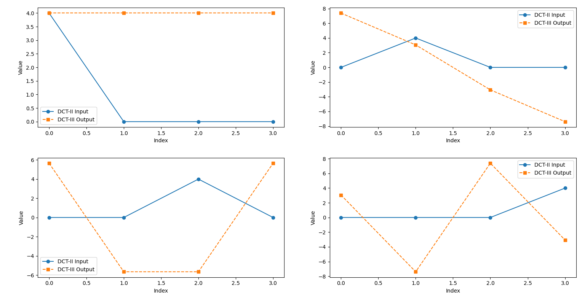

## Blueprint v1 (Old)

**Quadtree split macroblocks:**
-	**Lossless**
	-	RGB565 -> Self-similarity transform -> Sparse (XOR/Delta encoding & swap) bitplane encoding -> RLE -> Elias gamma coding
	-	RGB565 -> Self-similarity transform -> FWHT -> RLE -> Elias gamma coding
	-	RGB565 -> Self-similarity transform -> Haar wavelet -> RLE -> Elias gamma coding
-	**Lossy**
	-	YCoCg655 -> 4:2:0 -> DCT-II -> Attention map quantization -> Self-similarity transform -> Zig-Zag -> block-to-block delta coding -> Elias gamma coding
	-	YCoCg655 -> 4:2:0 -> DST-II -> Attention map quantization -> Self-similarity transform -> Zig-Zag -> block-to-block delta coding -> Elias gamma coding
	-	YCoCg655 -> 4:2:0 -> FWHT -> Attention map quantization -> Self-similarity transform -> Zig-Zag -> block-to-block delta coding -> Elias gamma coding
	-	YCoCg655 -> 4:2:0 -> Haar wavelet -> Attention map quantization -> Self-similarity transform -> Zig-Zag -> block-to-block delta coding -> Elias gamma coding
	-	RGB565 -> Self-similarity search -> Macroblock copy

**Notes**
-	Self-similarity transform will use rotations and flips to match the previous block.
-	The strength of quantization will be based on Sharpness Threshold Measure (%)
-	Sharpness Threshold Measure (%) is an in-house grayscale image metric that ignores subtle noise, like film grains. While checking for distracting noise like denoiser removed-noise. It returns in percentage scale.

**Archiver**
-	BZip3

## Core CLY Implementation
### **YCoCg**  
YCoCg is a different way to represent color in images. It separates luma (brightness) from color (chrominance).

First, YCoCg takes brightness as luma (Y), and purple is used as (Co), last, green is used as (Cg) with purple as luma.

Cg isn't pure green, but it stores purple as luma as well. Don't mislead by its name Co (chrominance orange), but it was red-blue chrominance, which is purple when combined.

This is the original JPG image.  
  
This is the luma (Y) of the image. It's black-and-white, since it's brightness.  
  
This is the purple chrominance (Co) of the image, the JPG's compression artifact shows JPG had removed to some extent of red on the edge of lemons.  
  
This is the green chrominance (Cg) with purple as luma of the image. The JPG began more aggressively removing the green color from the water part of lemons, as shown by the pink blocky artifacts when it was supposed to be gray or green.  
  
It has been proven over decades that the eyes can't see chrominance (Co, Cg) better than luma (Y) on a daily basis.

People found out it was much easier to remove chrominance pixels in YCoCg than RGB without others noticing. They did it by lowering the accuracy of YCoCg, regularly with divisions, and this is called quantization.

The point of YCoCg is to remove details in chrominance (Co, Cg) easily rather than improving luma's (Y) accuracy.

Quantization is used to maximize zeros in YCoCg, and later on transformed and compressed by RLE (Run-length encoding). RLE compresses images by counting repeating pixels 'n' times and store in a binary file. Then decompressing the image by repeating the same pixels 'n' times.

-	**RGB to YCoCg:**
```rs
fn rgb_to_ycocg(r: u8, g: u8, b: u8) -> (u8, i8, i8) {
	let y = r / 4 + g / 2 + b / 4;
	let co = (r as i16 - b as i16) / 2;
	let cg = -(r as i16 / 4) + g as i16 / 2 + -(b as i16 / 4);
	(y, co as i8, cg as i8)
}
```

-	**YCoCg to RGB:**
```rs
fn ycocg_to_rgb(y: u8, co: i8, cg: i8) -> (u8, u8, u8) {
	let y = y as i16;
	let co = co as i16;
	let cg = cg as i16;
	let r = y + co - cg;
	let g = y + cg;
	let b = y - co - cg;
	(r as u8, g as u8, b as u8)
}
```

### **DCT-II and DCT-III**
DCT-II coefficients wasn't in intuitive mathematically at all.
  

-	**DCT-II**
```py
def dct_ii(input_):
	len_ = input_.shape[0]
	coef = np.zeros(len_)
	for coeff_i in range(len_):
		for input_i in range(len_):
			coef[coeff_i] += input_[input_i] / len_ * np.cos(np.pi * coeff_i * (input_i + 0.5))
	return coef
```

-	**DCT-III**
```py
def dct_iii(input_):
	len_ = input_.shape[0]
	coef = np.zeros(len_)
	for coeff_i in range(len_):
		for input_i in range(1, len_):
			coef[coeff_i] += input_[input_i] * 2.0 * np.cos(np.pi * input_i / len_  * (coeff_i + 0.5))
		coef[coeff_i] += input_[0]
	return coef
```

### **Sharpness Threshold Measure (%) (STM)**
Sharpen often dependent on color, contrast, and noise changes. This made STM effective for measuring subjective image quality.

-	**Laplacian function**
```py
def calculate_laplacian(image):
	laplacian = np.array([[0, 1, 0],
						  [1, -4, 1],
						  [0, 1, 0]])
	return convolve2d(image, laplacian)
```
-	**Sharpness Threshold Measure**: It's recommended to set the threshold to 8 to ignore film grains.
```py
def calculate_sharpness_threshold_measure(original, transformed, threshold=8):
	original_array = np.array(original.convert('L'))
	transformed_array = np.array(transformed.convert('L'))

	laplacian1 = calculate_laplacian(original_array)
	laplacian2 = calculate_laplacian(transformed_array)

	sharpness_diff = np.abs(laplacian1 - laplacian2)
	sharpness_change_detected = sharpness_diff >= threshold
	sharpness_diff_pct = np.sum(sharpness_diff) / np.prod(sharpness_diff.shape) * 100.0
	sharpness_threshold_pct = np.sum(sharpness_change_detected) / np.prod(sharpness_diff.shape) * 100.0

	return sharpness_diff_pct, sharpness_threshold_pct
```
